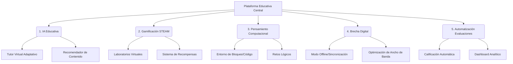

# Arquitectura y Estructura de la Propuesta Educativa

Este documento detalla la arquitectura y la estructura de los cinco pilares fundamentales de nuestra propuesta para la modernización e inclusión educativa.

## Arquitectura General

## 1. IA Educativa (Inteligencia Artificial para el Aprendizaje)
Este pilar se centra en la personalización de la experiencia de aprendizaje adaptándose al ritmo y estilo de cada estudiante.
* **Componentes clave:**
  * **Tutor Virtual Adaptativo:** Un chatbot o asistente basado en IA (LLMs) ajustado para responder dudas pedagógicas de forma segura y estructurada.
  * **Rutas de Aprendizaje Personalizadas:** Algoritmos que analizan el progreso del estudiante y sugieren los siguientes temas o ejercicios en función de sus necesidades.
  * **Análisis de Interacción:** Monitoreo del nivel de comprensión y compromiso del estudiante para intervenir a tiempo.

## 2. Gamificación STEAM (Ciencia, Tecnología, Ingeniería, Arte y Matemáticas)
Busca aumentar la motivación y retención de los estudiantes mediante mecánicas de juego en contextos científicos y creativos.
* **Componentes clave:**
  * **Proyectos Interactivos (Misiones):** Transformación de las unidades didácticas en "misiones" con narrativas inmersivas.
  * **Sistema de Insignias y Puntos:** Recompensas por hitos alcanzados, colaboración con compañeros y resolución de problemas complejos.
  * **Laboratorios Virtuales Simulados:** Entornos seguros donde los estudiantes pueden experimentar con simulaciones físicas, químicas o electrónicas.

## 3. Pensamiento Computacional
Desarrolla habilidades de resolución de problemas, abstracción y diseño de algoritmos desde edades tempranas.
* **Componentes clave:**
  * **Entornos de Programación:** Uso de programación visual (tipo bloques) para principiantes y lenguajes en texto (como Python) para niveles avanzados.
  * **Retos Algorítmicos:** Ejercicios progresivos que enseñan secuencias, bucles, condicionales y depuración de errores de forma estructurada.
  * **Integración Transversal:** Aplicación de la programación para resolver problemas aplicados a matemáticas, ciencias o arte.

## 4. Brecha Digital (Inclusión y Accesibilidad)
Garantiza que la solución tecnológica llegue a todos los estudiantes, independientemente de sus condiciones de conectividad o de hardware.
* **Componentes clave:**
  * **Arquitectura Offline-First:** La plataforma debe funcionar sin conexión a internet permanente, guardando el progreso localmente y sincronizándolo cuando haya red disponible.
  * **Optimización de Ancho de Banda:** Priorización de transmisión de datos esenciales (texto y estructuras ligeras) frente a contenido multimedia pesado.
  * **Soporte Multiplataforma:** Diseño responsivo compatible con dispositivos de entrada (smartphones antiguos, tablets básicas o equipos compartidos).

## 5. Automatización de Evaluaciones
Facilita la labor del docente, reduciendo la carga administrativa y proporcionando datos procesables en tiempo real.
* **Componentes clave:**
  * **Calificación Automática:** Corrección inmediata de cuestionarios, respuestas múltiples y ejercicios de código.
  * **Evaluación Asistida por IA:** Propuestas de retroalimentación preliminar para respuestas abiertas o redacciones cortas, con revisión final del docente.
  * **Dashboards de Analítica Académica:** Paneles de control para docentes que identifican el rendimiento, el progreso a nivel grupal y estudiantes que requieren apoyo.
